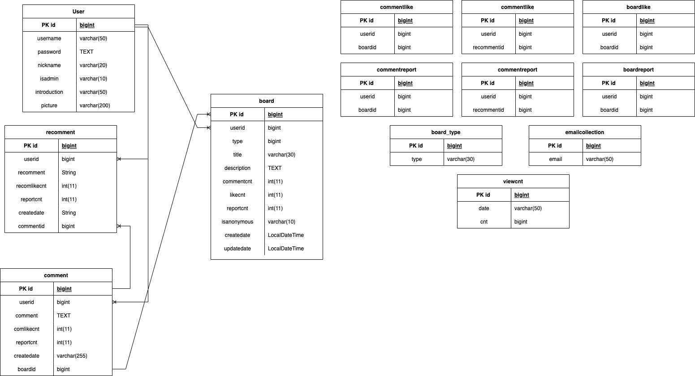
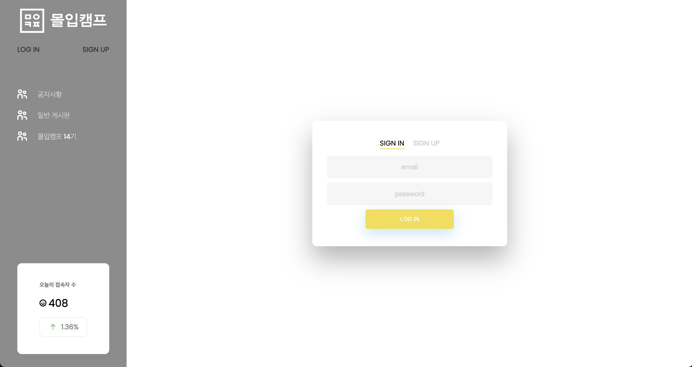
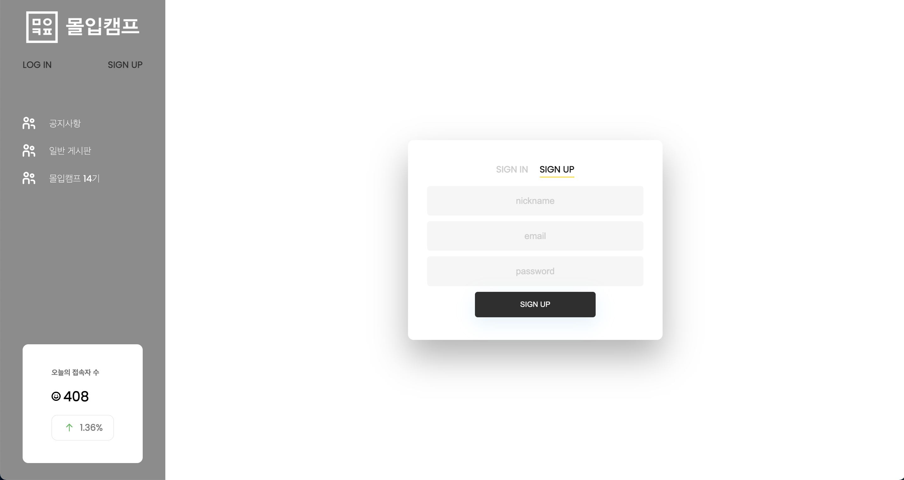

# MadTime
<a href="http://www.madtime.click">www.madtime.click</a>

#### 프로젝트 기간
- 2022.07.13 ~ 2022.07.19
#### 팀원
- 숙명여자대학교 최예빈
- 부산대학교 신종민
- 포항공과대학교 변민우

## 개발 환경
***
- IDE : IntelliJ IDEA Ultimate
- Git Tools : Source Tree, GitHub Desktop
- SpringBoot 2.7.1
- Java11
- Gradle

## 기술스택
***
- FrontEnd - `HTML` `CSS` `JS` `JSP`
- BackEnd - `Spring Boot` `JPA` `MySQL`
- Infra - `AWS EC2` `S3` `CodeDeploy` `Route 53` `CI/CD Github Actions` 

## ERD
***

## 프로젝트 소개
***
이 프로젝트는 몰입캠프 전용 에브리타임 웹 사이트입니다.
 
`로그인 / 회원가입`

- 닉네임, 이메일, 비밀번호를 입력하여 회원가입할 수 있습니다.
- 이미 가입한 유저의 이메일이거나 몰입캠프 참가자의 이메일이 아니면 이메일이 유효하지 않습니다.
- SIGN UP 버튼을 누르면 입력한 이메일로 인증번호가 전송되며, 인증번호를 입력할 수 있는 칸이 생깁니다.
- 인증번호를 올바르게 입력하면 회원가입이 가능합니다.

`메인 페이지`

